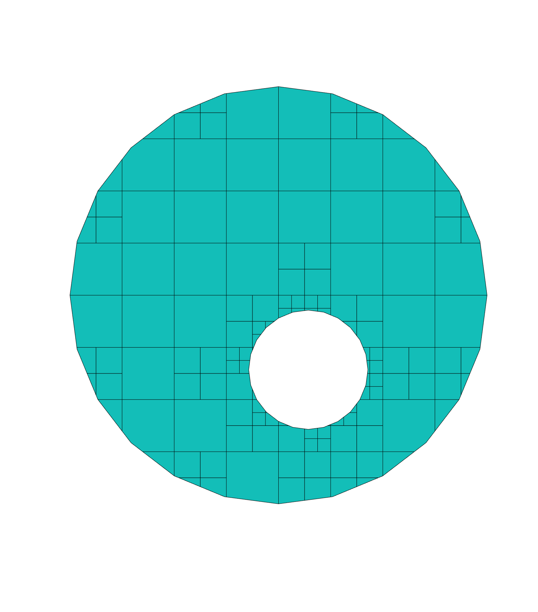
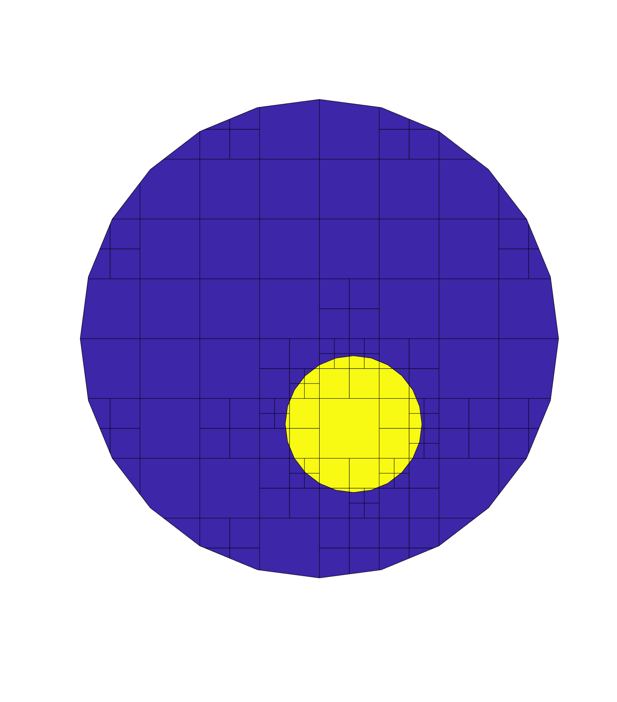
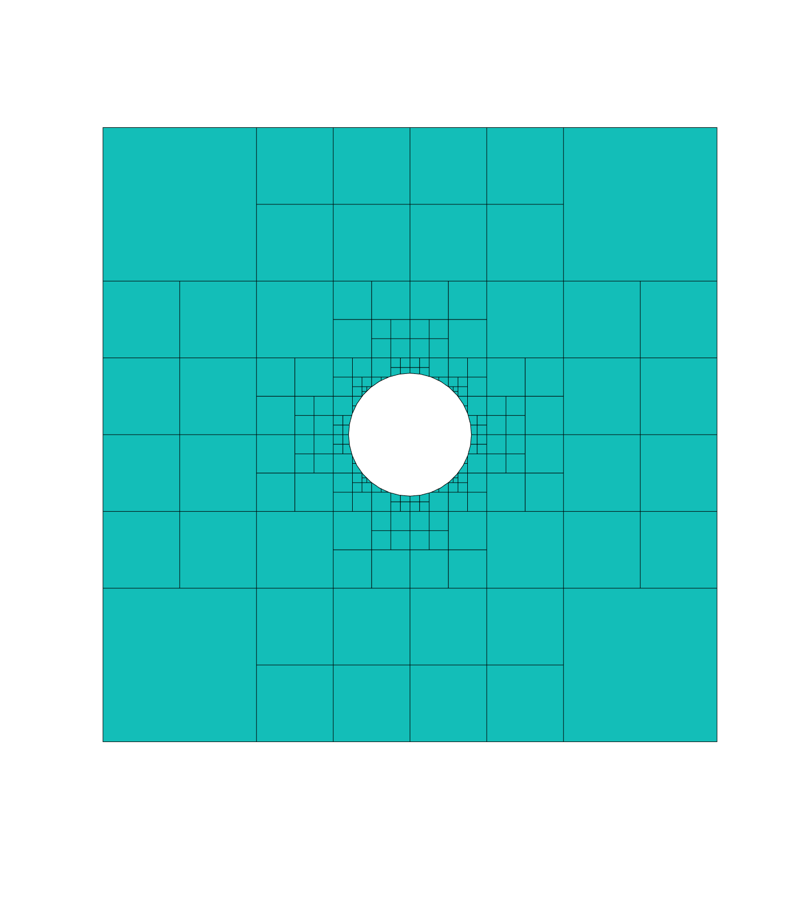
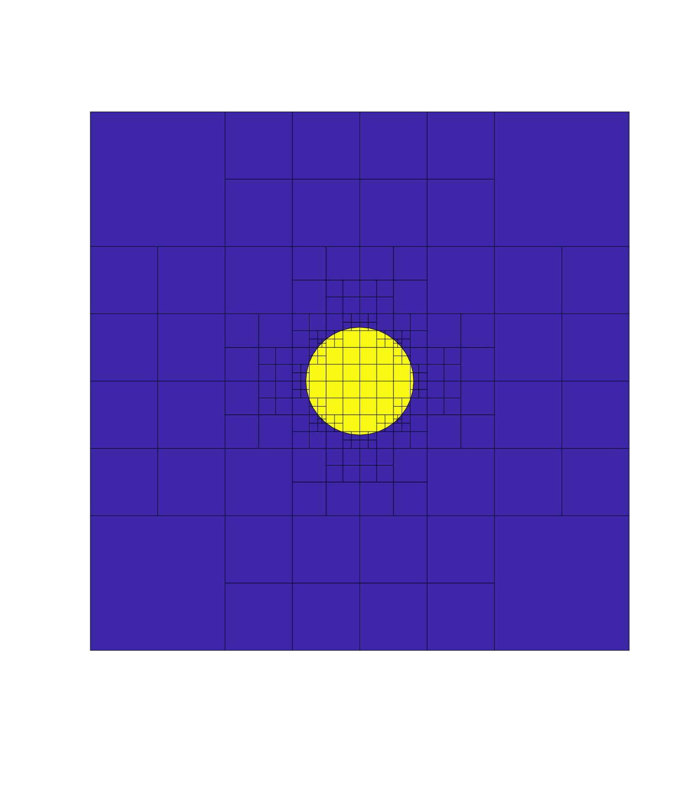
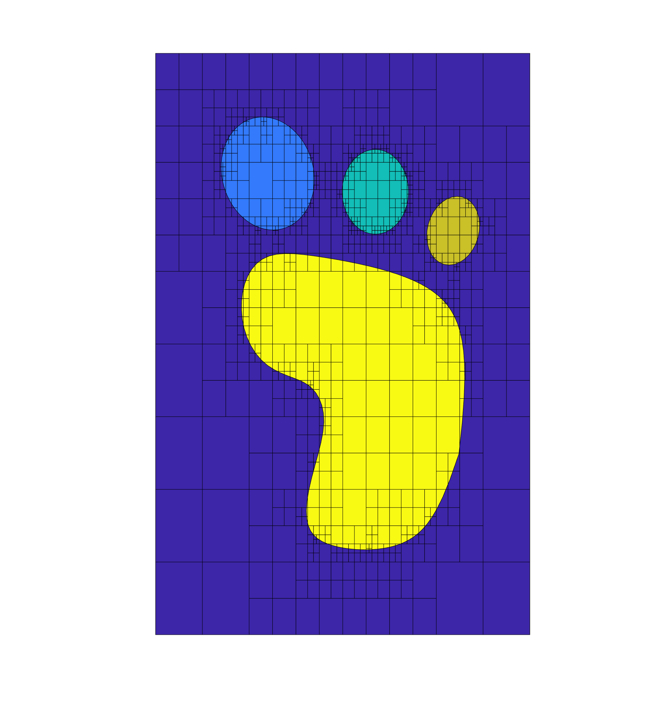

# What's in Examples? 

./Examples  
├── Example_1.txt  
├── Example_2.txt  
├── SquareCircularHole.txt  
├── SquareCircularInclusion.txt  
└── YetiFootprint.txt  

| File                          | Description                           |  Mesh |
| :---------------------------- | :------------------------------------ | :-----: |
|  Example_1.txt                | Circular disk with circular hole      |                                     |
|  Example_2.txt                | Circular disk with circular inclusion |                                     |
|  SquareCircularHole.txt       | Square with circular hole             |            |
|  SquareCircularInclusion.txt  | Square with circular inclusion        |  |
|  YetiFootprint.txt            | Yeti footprint                        |                            |

