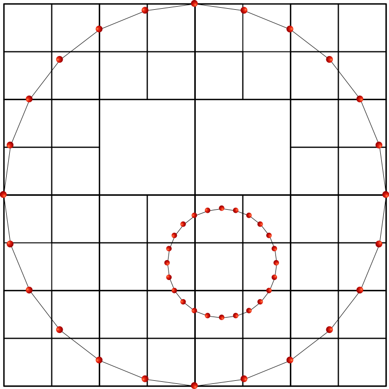

# A Quadtree based finite element mesh generator to discretize two-dimensional heterogeneous solids

To discretize two-dimensional heterogeneous solids, a quadtree based finite
element mesh generator is developed. The solid is given by its outer boundary
and material interfaces. These are later modeled by simple closed polygonal
chains. 

| | | |
| :---: | :---: | :---: |
|  |   |  |
|  |  |  |
|  |  |  |
|  |  |  |

## Table of contents  

1. [What's in the directory? ](#whats-in-the-directory)
2. [Prerequisites ](#prerequisites)
3. [Getting started ](#getting-started)  
4. [Acknowledgments](#acknowledgments)
5. [Contact](#contact)

# What's in the directory? 

.  
├── Documentation.md  
├── Examples  
├── Makefile  
├── QtreePlotMesh.m  
├── README.md  
└── src  

| File            | Description |
| :-------------- | :---- |
| Documententation.md | Documentation |
| Examples            | Contains examples of how to define the domain to be meshes |
| Makefile            | Makefile to build the project |
| QtreePlotMesh.m     | MATLAB script to plot quadtree mesh |
| README.md           | This file |
| src                 | Source code |

# Prerequisites 

# Getting started 

# Acknowledgments 

The financial support of the DFG (German Research Foundation) under 
[project number 433734847](https://gepris.dfg.de/gepris/projekt/433734847?language=en)
is gratefully acknowledged.

# Contact   

**Rainer Reichel** M.Sc.  
LBB - Lehrstuhl für Baustatik und Baudynamik  
RWTH Aachen University 
email: <reichel@lbb.rwth-aaachen.de>

